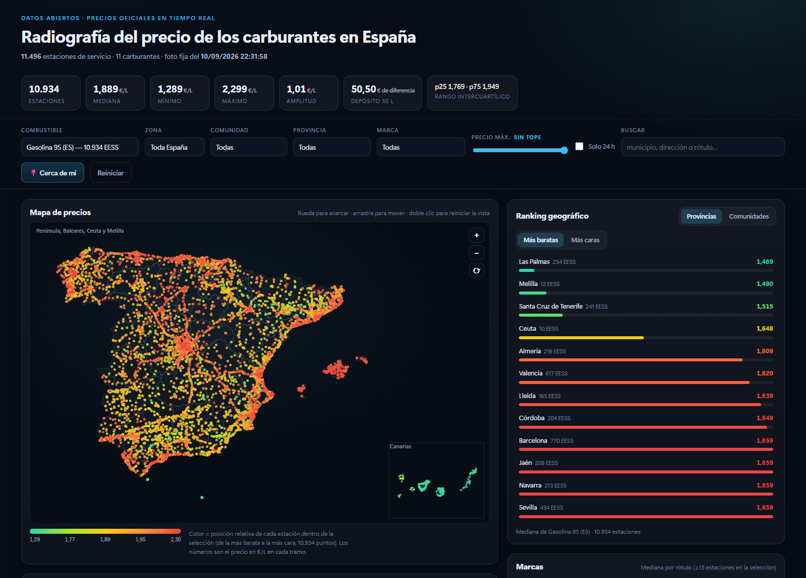

# Radiografía del precio de los carburantes en España

Análisis y visualización interactiva de los precios de todos los carburantes en las **11.496 estaciones
de servicio de España**, a partir de los datos abiertos del Ministerio para la Transición Ecológica
y el Reto Demográfico (API pública, sin clave).



## Qué hay aquí

| Ruta | Qué es |
|---|---|
| `data/raw_estaciones.json` | Volcado original descargado de la API (11,7 MB, ~11.500 estaciones, 40 campos). |
| `data/analysis.json` | Agregados del análisis: estadísticas por combustible, provincia, comunidad, zona y marca; dispersión municipal; calidad del dato. |
| `data/informe.md` | Informe escrito con los resultados (tablas y conclusiones). |
| `web/index.html` · `styles.css` · `app.js` | Dashboard interactivo (HTML+CSS+JS puro, sin dependencias ni CDN). |
| `web/data/dataset.json` | Estaciones compactadas para el navegador (1,6 MB). |
| `web/data/provincias.json` | Contornos provinciales simplificados para el mapa. |
| `analyze.py` · `prep_geo.py` · `informe.py` | Cadena reproducible: normaliza, agrega, simplifica el mapa y redacta el informe. |
| `explore.py` | Exploración inicial del esquema del volcado. |
| `shots/` | Capturas de la verificación visual hecha con Chrome headless. |

## Cómo verlo

La página lee los datos con `fetch()`, así que necesita un servidor local (no vale abrir el archivo
directamente con `file://`). La forma más rápida, desde esta carpeta:

```powershell
.\servir.ps1
```

o directamente:

```powershell
python -m http.server 8765 --bind 127.0.0.1 --directory .\web
```

y abrir <http://127.0.0.1:8765/>.

## Qué hace el dashboard

- **Mapa** de las 11.500 estaciones con sus coordenadas reales (sin mapa base): cada punto es una estación,
  coloreada por su posición relativa de precio dentro de la selección. Zoom con rueda, arrastre para moverse,
  clic en un punto para ver la ficha completa con todos sus carburantes.
- **Filtros** combinables: combustible (11), zona (incluye Canarias y Baleares), comunidad, provincia, marca,
  solo 24 h, tope de precio y buscador por municipio, dirección o rótulo.
- **Histograma** del precio con mediana, media y tope aplicado (clic en una barra para fijar el tope).
- **Rankings** de provincias y comunidades (más baratas / más caras) y de marcas, recalculados con los filtros.
- **Misma ciudad, precios distintos**: municipios con mayor brecha entre la estación más barata y la más cara,
  con el ahorro por depósito de 50 litros; al hacer clic se resaltan ambas en el mapa.
- **Tabla** de las 120 estaciones más baratas (o más caras, o más cercanas si das permiso de ubicación).
- **Hallazgos** redactados automáticamente a partir de la selección actual.
- El estado vive en la URL (`#fuel=1&prov=Madrid`), así que cualquier vista se puede compartir o recargar.

## Reproducir el análisis

```bash
curl -o data/raw_estaciones.json \
  https://sedeaplicaciones.minetur.gob.es/ServiciosRESTCarburantes/PreciosCarburantes/EstacionesTerrestres/
python analyze.py     # normaliza y agrega -> data/analysis.json + web/data/dataset.json
python prep_geo.py    # contornos provinciales -> web/data/provincias.json
python informe.py     # informe -> data/informe.md
```

Sin dependencias externas: solo la biblioteca estándar de Python 3 y JavaScript de navegador.

## Fuente y límites

- Fuente: [precios de carburantes](https://sedeaplicaciones.minetur.gob.es/ServiciosRESTCarburantes/PreciosCarburantes/EstacionesTerrestres/),
  datos abiertos del Ministerio para la Transición Ecológica y el Reto Demográfico. El archivo se actualiza
  cada media hora, así que las cifras son una foto fija del momento indicado en la cabecera del informe.
- Los precios son los declarados por las estaciones; el análisis es estadística descriptiva del momento de la
  descarga y no una recomendación de repostaje.
- Los rótulos se normalizan por reglas (marcas con menos de 15 estaciones se agrupan en «Otras marcas»), por lo
  que las comparaciones entre marcas son aproximadas y están parcialmente contaminadas por la geografía.
